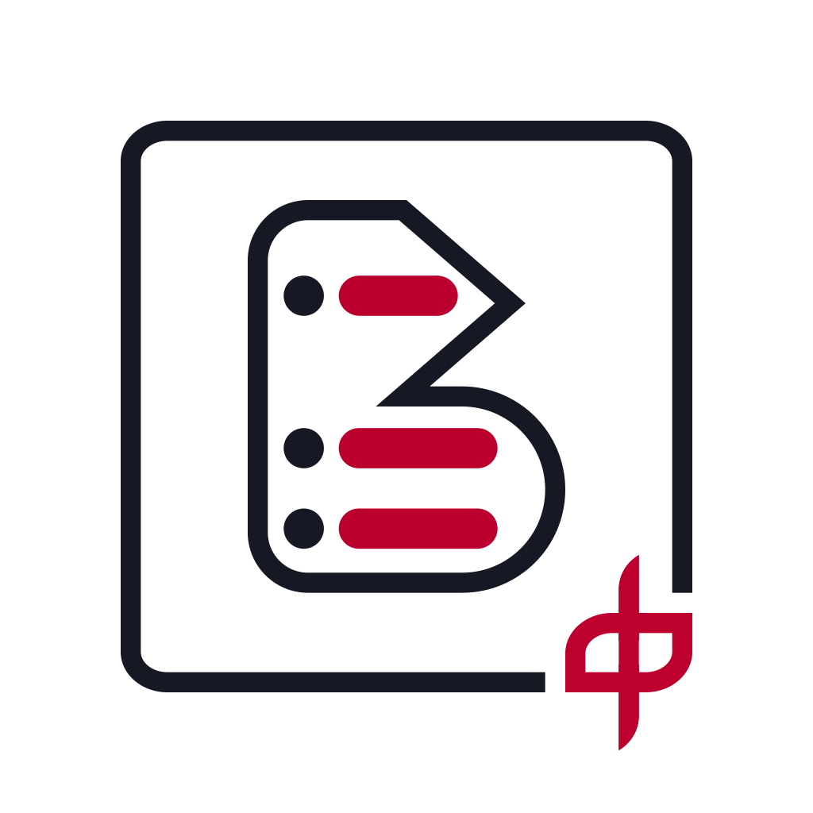

# 中文博客列表导航项目

&nbsp;&nbsp;&nbsp;&nbsp;
&nbsp;&nbsp;&nbsp;&nbsp;

---

<table>
<td>
 
</td>
<td>
 <h4>
        

        目前我们依旧在维护 <a href="https://github.com/zh-blogs/v2">V2 版本</a> 的项目程序，V3 版本的项目程序正在积极开发中，项目所涉及的审核标准和相关流程也在逐渐完善中。  
        诚挚邀请对项目感兴趣的您参与到本项目的建设当中来，您可以选择<b>参与开发</b>和<b>参与维护</b>的任意一项，通过本项目的 issue 联系我们。  
        当然，如果您对本项目有更好的建议或者意见，也欢迎您通过 issue 向我们反馈，我们会慎重考虑您的意见和意见。  
        <a href="https://github.com/zh-blogs/frontend">中文博客列表导航 V3 版本前端</a>  |  <a href="https://github.com/zh-blogs/backend">中文博客列表导航V3版本后端</a>  |  <a href="https://github.com/zh-blogs/blog-daohang/issues/new/choose">联系我们</a>
        

    </h4>
</td>
</table>

---

## 功能列表

本项目尝试链接全部中文独立博客，目前含有如下功能：

1. **查看随机推荐的博客**。
2. **随机前往已收录的博客**，您可以通过在 URL 添加参数进行指定类型博客的随机跳转，如：[https://zhblogs.ohyee.cc/go?tags=生活](https://zhblogs.ohyee.cc/go?tags=生活)，即可随机访问生活类博客。
3. 查看本项目 **收录博客的部分数据统计** （如：**博客架构统计**、**域名统计** 等）。

## 博客收录

目前，我们通过以下三种方式对博客进行收录：

1. 通过一些博客集合（上游库）发现并收录。
2. 参考已收录博客的友情链接进行收录。
3. 博主的自主提交。

我们会依据 [项目相关标准](#项目相关标准) 对博客进行 **博客收录**、**信息完善**、**博客分类** 等相关操作，如您发现项目中您博客的信息、分类等内容有误，或者在浏览过程中发现其它博客的信息有误，也欢迎您通过 Issue 提出修改意见，我们会尽快处理。

## 项目相关标准

我们对项目实行的相关标准和流程（下称 **文档**）放置在当前项目仓库的 [WIKI]() 选项卡中，您可以点击链接前往阅读。

以下是文档的简要目录和说明：

> Work In Process

欢迎您对项目文档提出意见或建议，我们会考虑您的提议，来不断完善本项目的各种标准和流程。

## 支持我们

如果您喜欢本项目，不妨通过以下方式支持该项目：

1. 您可以在项目中搜索您的博客，若未收录，您可以在 issue 中找到申请添加的链接，若已收录，您可以在 issue 中找到信息完善的选项，帮助我们完善您博客的相关信息。
2. 您可以为本仓库点一个 Star。
3. 您可以为本项目做宣传，让更多博主知道本项目。
4. 您可以加入本项目的技术组或者维护组，对本项目进行维护。

> 若您有博客申请收录、博客信息修改、博客失效反馈、博客信息完善、项目 BUG 反馈、项目功能建议等内容需要与项目组进行反馈，您可以前往 [Issues · zh-blogs/blog-daohang](https://github.com/zh-blogs/blog-daohang/issues/new/choose) 选择对应的模板进行反馈
>
> 参与本项目相关标准构建，请参考：[项目标准贡献](./CONTRIBUTING.md)
>
> 参与 V3 版本前端开发，请参考：[V3 版本前端贡献](https://github.com/zh-blogs/V3-frontend/blob/main/CONTRIBUTING.md)
>
> 参与 V3 版本后端开发，以及加入项目维护组请通过上方 **Issue 选项卡中的加入我们** 与我们联系

## 维护成员名单（排名不分先后）

> 本项目尊重维护人员个人意愿，根据维护人员个人情况决定对项目是否继续进行维护。
>
> 依照 [项目维护意向调查 Issue #24](https://github.com/zh-blogs/blog-daohang/issues/24) 
>
> 感谢对本项目做出贡献的各位维护人员，你们的付出是对本项目最大的支持和鼓励。

现项目维护人员：

> 技术组：负责对本项目的相关程序进行开发和维护，包括但不限于项目的前端、后端、数据同步工具等。
>
> 维护组：负责对本项目的项目数据进行维护，包括但不限于项目博客审核、信息完善、标准完善等。

|                      技术组                       |                            维护组                            |
| :-----------------------------------------------: | :----------------------------------------------------------: |
| [OhYee（技术组负责人）](https://github.com/OhYee) | [linlinzzo（项目整体负责人、维护组负责人）](https://github.com/linlinzzo) |
| [soxft（技术组负责人）](https://github.com/soxft) | [MYXXTS（维护组负责人、项目标准制定人）](https://github.com/MYXXTS) |
|         [Mabbs](https://github.com/Mabbs)         |          [aquausora](https://github.com/aquausora)           |
|     [wibus-wee](https://github.com/wibus-wee)     |         [gtxykn0504](https://github.com/gtxykn0504)          |
|    [liangmiQwQ](https://github.com/liangmiQwQ)    |           [Lafcadia](https://github.com/Lafcadia)            |
|     [Redish101](https://github.com/Redish101)     |                                                              |

前项目维护人员：

[@Innei](https://github.com/Innei) [@jsun969](https://github.com/jsun969) [@zkeq](https://github.com/zkeq) [@Dian-C](https://github.com/Dian-C) [@huziyan1](https://github.com/huziyan1) [@jonepengcn](https://github.com/jonepengcn) [@Kagurain](https://github.com/Kagurain) [@liangmis](https://github.com/liangmis) [@Timozaici](https://github.com/Timozaici) [@Changrui0101](https://github.com/Changrui0101) [@Lfhsheng](https://github.com/Lfhsheng) [@hydrogenoxide-user](https://github.com/hydrogenoxide-user) [@Innei](https://github.com/Innei) [@Amitabha](https://github.com/Amitabha)  [@waterelegance](https://github.com/waterelegance)  [@linhaii](https://github.com/linhaii) [@yzqzss](https://github.com/yzqzss) [@hilllei](https://github.com/hilllei)

## 感谢以下网站对本项目的宣传

[友链 – 阿锋的小宇宙 (feng.pub)](https://feng.pub/links)

[中文独立博客圈 - 博客志 (jetli.com.cn)](http://www.jetli.com.cn/quan.html)

[中文博客列表导航项目 - 杜老师说 (dusays.com)](https://dusays.com/494/)

[谈谈几个博客聚合网站，以及个人推荐 – 铎鸣也 (wordpress.com)](https://zhengduo.wordpress.com/2022/12/09/zh-blogs-site-link/)

[万亿及秭 - peachRL 的小站 (wanyijizi.com)](https://wanyijizi.com/)
